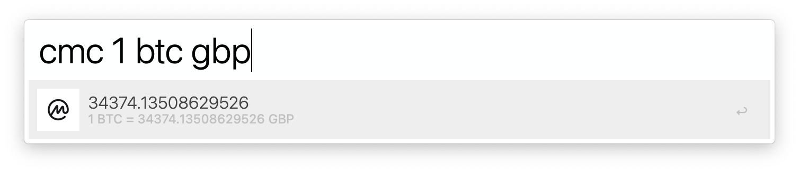

# Alfred CoinMarketCap

Alfred workflow for quick cuccencies conversion using [CoinMarketCap API](https://coinmarketcap.com/api/).

## Prerequisites

- The [CoinMarketCap API key](https://coinmarketcap.com/api/) (free is more than enough)
- The [deno](https://deno.land) runtime installed

## How to use

- `cmc 1 btc` - Convert 1 Bitcoin to your default currency
- `cmc 1 btc eur` - Convert 1 Bitcoin to specified currency (Euro in this case)
- Hit `↵` to copy the result to clipboard
- Holding `⌘` key, hit `↵` to open CoinMarketCap website on selected coin
